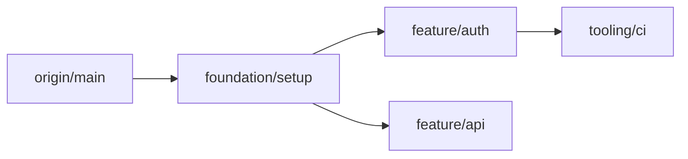

<!--
title: Git Rebase Standardization
description: Hierarchical multi-branch rebasing with dependency mapping,
    Commit Action Mapping (CAM), dig-down fidelity, and
    operational guardrails.
category: Git & Repository Management
-->

# Git Rebase Standardization Skill

> **Skill ID:** `git_rebase`
> **Version:** 1.0.0
> **Standard:** [Agent Skills (agentskills.io)](https://agentskills.io)

## Description

Manage complex, multi-branch Git rebases with hierarchical alignment,
cross-branch deduplication, and absolute commit fidelity. This skill
covers dependency mapping via Mermaid graphs, Commit Action Mapping
(CAM) tables, the "Dig Down" content analysis principle, literal
execution protocols, and operational guardrails.

This skill is invoked for complex rebase operations involving multiple
branches or chain rebasing. For constructing new commits, use
[`git_atomic_commit`](../git_atomic_commit/SKILL.md). For splitting
existing commits, use
[`git_history_refinement`](../git_history_refinement/SKILL.md).

## Source Rules

| Rule File | Scope Incorporated |
|---|---|
| [`git-rebase-standardization-rules.md`](../../../ai-agent-rules/git-rebase-standardization-rules.md) | All sections (primary source) |

## Prerequisites

| Requirement | Minimum |
|---|---|
| VCS | Git 2.x+ |
| Shell | PowerShell 5.1+ or Bash 4+ |
| Access | Write access to the project repository |

## When to Apply

Apply this skill when:
- A user asks to rebase a branch or chain of branches
- Multiple feature branches need hierarchical alignment against a base
- Cross-branch commit deduplication is needed
- A rebase plan requires visualization and commit categorization
- The user asks to "clean up branch history" involving multiple branches

Do NOT apply when:
- The task is constructing new commits from uncommitted changes — use
  [`git_atomic_commit`](../git_atomic_commit/SKILL.md)
- The task is splitting a single existing commit — use
  [`git_history_refinement`](../git_history_refinement/SKILL.md)
- A simple `git rebase` onto one target with no chain complexity

---

## Step-by-Step Procedure

### Step 1 — Hierarchical Dependency Mapping

Before any rebase execution, map branch dependencies using a Mermaid
graph. This serves as the architectural blueprint.

#### 1a — Dependency Visualization

Every complex rebase plan MUST include a `mermaid` diagram defining:

- **Base Anchor:** The target branch (e.g., `main` or `origin/main`)
- **Chain Segments:** Groupings of branches by concern (Foundation,
  Logic, Tooling)
- **Branch Relationships:** Clear directional arrows showing the rebase
  path



#### 1b — Discover Default Branch

Do NOT assume the default branch name. Discover it programmatically:

```bash
git branch -r
```

---

### Step 2 — Commit Action Mapping (CAM)

Categorize every significant commit in the chain using a CAM table.

| Action | Definition | Constraint |
|---|---|---|
| **KEEP** | Functional changes unique to the branch | Verify no duplication in parent branches |
| **REWORD** | Commit requires better fidelity or "Dig Down" details | MUST include literal message payload in plan |
| **DROP** | Commit is redundant or already present in a parent | State the specific redundant SHA or logic |
| **SQUASH** | Related commits merged for atomicity | Title MUST follow Conventional Commits |

Present the CAM table to the user for approval before executing any
rebase operations.

---

### Step 3 — The "Dig Down" Fidelity Principle

For every **REWORD** action — especially involving binary, LFS, or
complex config files — the agent MUST "dig down" into the content.

- **Content Analysis:** Inspect the actual hunk or blob (e.g., `cat -v`,
  `jq`, or `file` analysis)
- **Explicit Mention:** The commit body MUST list specific package
  changes, configuration keys, or binary assets added/modified
- **Rationale:** Explain *why* these specific changes were grouped
  together or why they are critical for the branch context

---

### Step 4 — Literal Execution Protocol (SSOT)

Implementation plans for history-altering operations MUST be Single
Source of Truth (SSOT) and exhaustive.

- **Exact Commands:** Include the literal CLI commands (e.g.,
  `git rebase --onto <newbase> <upstream> <branch>`)
- **Literal Payloads:** Message bodies MUST be provided as literal
  strings to prevent "hallucination" during execution
- **Atomic Hygiene:** Every step MUST include necessary cleanup commands

---

### Step 5 — Execution

Execute the rebase according to the approved plan.

#### 5a — Backup Before Rebase

Create a backup branch before any destructive operation (per the
[`git_history_refinement`](../git_history_refinement/SKILL.md) backup
protocol):

```bash
git branch backup/pre-rebase-<n>
```

#### 5b — Rebase Command

```bash
git rebase --onto <newbase> <upstream> <branch>
```

For interactive rebase with CAM actions:

```bash
git rebase -i <base-commit>
```

Apply KEEP, REWORD, DROP, SQUASH actions as specified in the CAM table.

#### 5c — Empty Commit Guardrail

The agent is **PROHIBITED** from skipping empty commits
(`git rebase --skip`) without explicit user confirmation.

---

### Step 6 — Operational Verification & Guardrails

#### 6a — Rebase-Reset Recovery

If a reword accidentally applies to the wrong branch (detected via
`git status` or `git log`):

1. **Stop immediately**
2. **Reverse using Reflog:** identify the clean state and
   `git reset --hard` back to it
3. **Re-execute** from the correct branch

#### 6b — Post-Operation Hygiene

After every successfully completed branch rebase:

1. **Garbage Collection:**
   ```bash
   git gc --prune=now
   ```
2. **Tag Cleanup:** Delete temporary backup tags created for the
   operation
3. **Graph Verification:**
   ```bash
   git log --oneline --graph -n 5
   ```

#### 6c — Tree Parity Verification

Compare the final rebased state against the backup to ensure no content
was lost:

```bash
git diff HEAD <backup-branch>
```

Expected: Empty diff.

---

## Prohibited Behaviors

The agent is **BLOCKED** from:

- **Rebasing without a backup branch** — Mandatory before any
  destructive operation
- **Skipping empty commits without user confirmation** — Every skip
  requires explicit approval
- **Assuming the default branch name** — Must discover programmatically
- **Using generic REWORD messages** — Must "dig down" into content for
  fidelity
- **Executing rebase without CAM table approval** — User must review and
  approve the categorization
- **Force-moving backup branches** — Use incremental naming, never `-f`
- **Omitting literal command payloads from plans** — Plans must be SSOT
  with exact commands and message strings

## Common Pitfalls

| Pitfall | Solution |
|---|---|
| Reword applied to wrong branch | Stop, reverse via reflog, re-execute from correct branch |
| Empty commit during rebase | Do NOT skip without asking user — may indicate a logic error |
| Cross-branch duplicate commits | Use CAM table to identify and DROP redundant commits |
| Backup branch overwritten | Use incremental naming (`-1`, `-2`, `-3`) |
| Assumed `main` but repo uses `master` | Discover default branch via `git branch -r` |
| Rebase plan hallucinated commit messages | Provide literal payloads in the plan — never generate at execution time |
| Graph integrity broken after chain rebase | Run `git log --oneline --graph` and verify against the Mermaid blueprint |
| Binary file commit message says "update file" | "Dig down" — inspect blob content and list specific changes |
